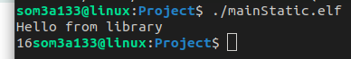
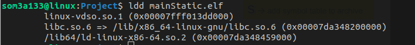
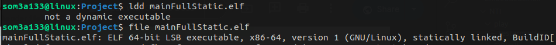
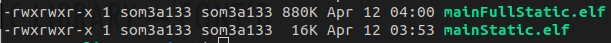
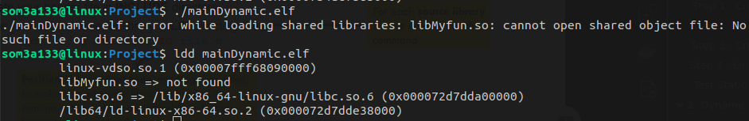
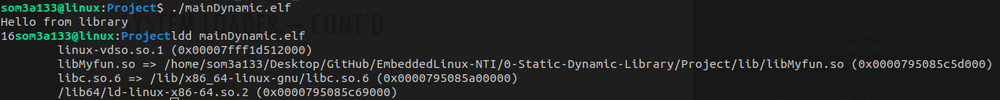
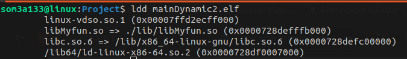

# Library

A library, in the context of software development, is a collection of pre-written code or routines that provide specific functionality. These functions are grouped together and stored in a common location, making them reusable across multiple projects. Libraries can include functions for various purposes such as mathematical calculations, string manipulation, file handling, user interface development, networking, and more.

# Types

**Static Libraries:**

* Linked directly into the executable at compile time.
* Results in larger executable files.
* Simplifies distribution as all necessary code is included.
* Requires recompilation for updates or changes.

**Dynamic Libraries:**

* Loaded into memory at runtime.
* Shared between multiple processes, reducing memory usage.
* Allows for easier updates and maintenance.
* Requires separate distribution of library files.

# 1. Static Library

A static library is a collection of object files that have been compiled and linked together to form a single library file that can be linked directly into a program at compile-time it. **lib*.a > represent static lib**

## Step 1 : Create Project

```
mkdir Project
cd Project
mkdir lib includes
cd lib
vim print.c
vim add.c
```

```
#include <stdio.h>
void print(void)
{
	printf("Hello from library");
}

##
int add(int x,int y)
{
	return x+y;
}

```

## Step 2 : Compiling & archiving

Now we will compile all files in  ./lib to get the *.o  object files

```
gcc -c *.c

```

After that we will archive object files

```
ar rcs libMyfun.a *.o 
```

r : replace or insert file to archive | c : create new archive | s : add symbol table to archive

## Step 3 : Create main.c

go to your project Directory ./Project

```
vim main.c

#include <stdio.h>
#include "add.h"
#include "print.h"
int main(void)
{
        print();
        printf(add(3,13));
}

```

These inlcudes *.h files will be in ./includes  just have prototypes of the 2 functions

## Step 4 : Linking library and add includes

Link library to main.c and add includes files to it

```
gcc main.c -I ./includes -L. ./lib/libMyfun.a -o mainStatic.elf

```

## Test Static Library



Here this Elf is staticly linked to library called libMyfun.a  but it's not full Staticly linked to other libraries

```
ldd ./mainStatic.elf
```



if you want to make it Staticly linked app just add `-static` flag

```
gcc main.c -I ./includes -L. ./lib/libMyfun.a -static -o mainFullStatic.elf
```

**Output:**



Here size of both are diff as larger size for the full static elf



# 2. Dynamic Library

A Dynamic library is a type of library that is linked to an executable program at runtime, rather than being linked at compile time. **lib*.so >represent shared object**

## Step 1: Create Dynamic library with the same project

```
cd ./Project/lib
gcc -c -fPIC *.c
```

`fPIC` : Position-independent code, this flag is needed to make sure when the library is loaded in runtime, is loaded at specific address to be known by the application

Create Shared Library :

```
 gcc -shared -o libMyfun.so *.o

```

## Step 2 : linking library & includes

Now go and compile your main.c  & add includes , library

```
gcc main.c -I ./includes/ -L./lib -lMyfun -o mainDynamic.elf
```

## Test Dynamic Library

```
./mainDynamic.elf
```



## Library not found ?

## System loader !

is a component of the operation system responsible for loading executable
programs or shared library. It is invoked when the application launched by user or another
program.

If the program or library has dependencies on other shared libraries, the loader must load those libraries and link them to the program or library.

System loader automatically search for the library in LD_LIBRARY_PATH **[FIRST PRIORITY]**(if it is set), it override the default search path which is /usr/lib, /lib32, /usr/lib32 **[2ND PRIORITY]**

```
export LD_LIBRARY_PATH=<>/Project/lib/  
```



Other way :  Compile with rpath option **[THIRD PRIORITY]**

```
gcc main.c -I ./includes/ -L./lib  -Wl,-rpath=./lib/ -lMyfun  -o mainDynamic2.elf
```


