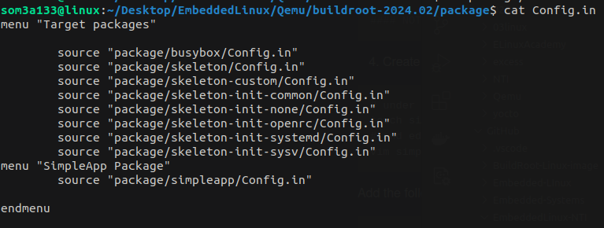
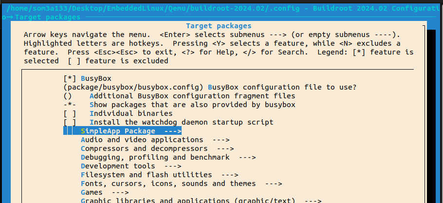
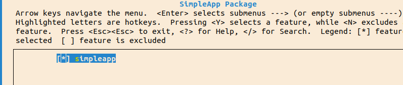
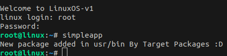

# Adding Package to BuildRoot

## Step1: Prepare your simple package

```
cd <PATH>/buildroot<ver>/package/
mkdir simpleapp
mkdir src
cd src
vim simpleapp.c

```

```
#include <stdio.h>

int main(void) {
	printf("New package added in usr/bin By Target Packages :D \r\n");
}
```

## Step 2 :  create Makefile to compile our package

```
.PHONY: clean
.PHONY: simpleapp

simpleapp: simpleapp.c
	$(CC) -g -Wall $(CFLAGS) $(LDFLAGS) $< -o $@

clean:
	-rm simpleapp

```

## Step 3: create makefile for buildroot to configure our package

```
cd ..
vim simpleapp.mk
```

```
################################################################################
#
# simpleapp package
#
################################################################################

SIMPLEAPP_VERSION = 1.0
SIMPLEAPP_SITE = package/simpleapp/src
SIMPLEAPP_SITE_METHOD = local# Other methods like git,wget,scp,file etc. are also available.

define SIMPLEAPP_BUILD_CMDS
    $(MAKE) CC="$(TARGET_CC)" LD="$(TARGET_LD)" -C $(@D)
endef

define SIMPLEAPP_INSTALL_TARGET_CMDS
    $(INSTALL) -D -m 0755 $(@D)/simpleapp  $(TARGET_DIR)/usr/bin
endef

$(eval $(generic-package))


```

```
#Create Config file for our package to be added  in Buildroot menu
vim Config.in
```

```
config BR2_PACKAGE_SIMPLEAPP
    bool "simpleapp"
    help
        simpleapp package.

```

**Tree of Files should look like :**

.
├── Config.in
├── simpleapp.mk
└── src
    ├── Makefile
    └── simpleapp.c

## Step 4 : Add our package menu under Target packages

```
menu "SimpleApp Package"
	source "package/simpleapp/Config.in"

endmenu

```


```
cd buildroot<ver>/package/
vim Config.in
```

menu "SimpleApp Package"



# Test 






