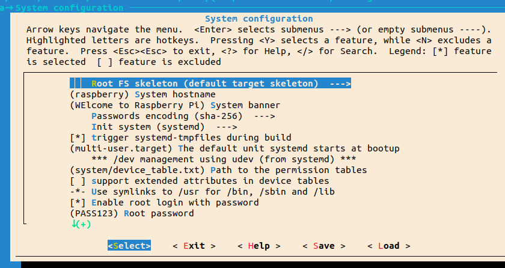
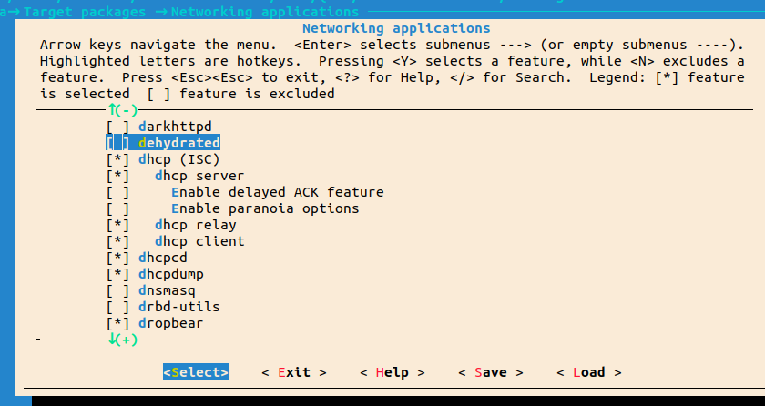
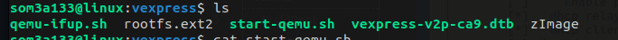
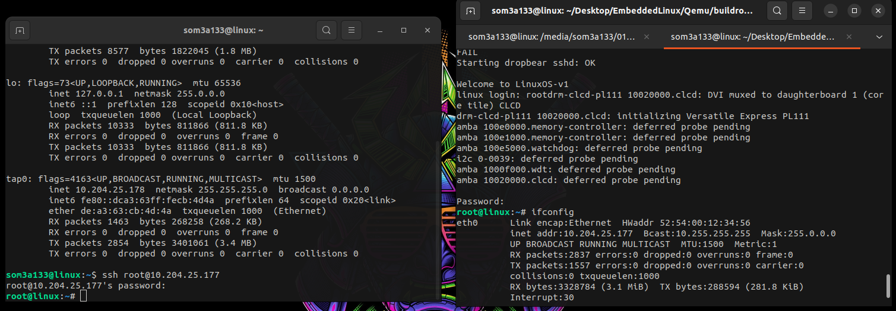
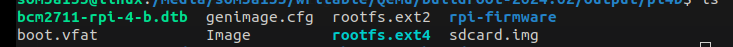
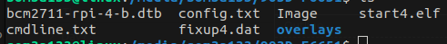
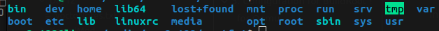
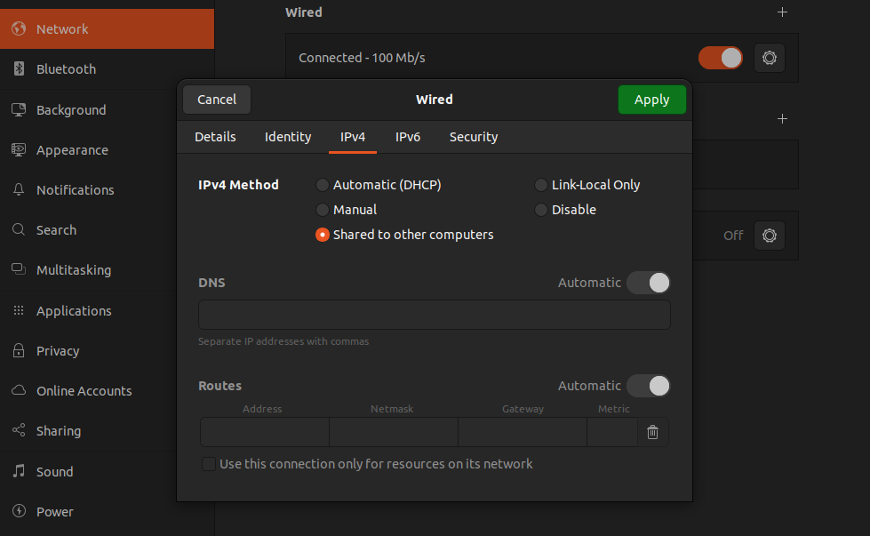
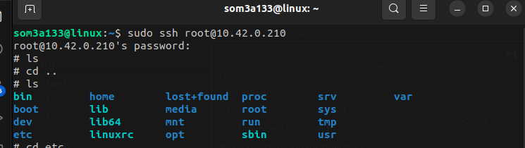

# BuildRoot

Buildroot is an open-source project aimed at facilitating the process of building embedded Linux systems. It provides a framework for generating custom cross-compilation toolchains, root filesystems, and kernel images tailored to specific embedded hardware platforms. Buildroot automates the process of configuring, compiling, and packaging the necessary components of a Linux system, including bootloader, kernel, libraries, and user-space applications.

# 1. Setting up Enviornment

Need to download the following essential dependicies

```shell
sudo apt install sed make binutils gcc g++ bash patch \
gzip bzip2 perl tar cpio python unzip rsync wget libncurses-dev
```

# 2. Download BuildRoot

```
git clone https://github.com/buildroot/buildroot.git
cd buildroot

```

# 3. Configuration for BuildRoot !

List all supported boards  configuration by Buildroot

```
make ls-configs  
### or ###
ls configs/
```

## for Qemu

```
make qemu_arm_vexpress_defconfig
```

## for Raspberry pi 4 - 64

```
ls configs/ | grep rasp
make raspberrypi4_64_defconfig
```

**In the configuration, configure the following  requirement :**

```
make menuconfig
```

* [ ] Init procecss to **System V** or **System D** or **Busybox init**

`In case of using systemD increase the root file system size from build root configuartion`

* [ ] Change **system host**
* [ ] Change **system banner**
* [ ] Appy **root password**



NOTE : For **systemV** it makes a default etc/network/interfaces file for raspi4 while for **systemD** it didnt make etc/netowrk/interfaces so check dhcpcd packages to automatic DHCP when local connected with eth cable with PC to be able to connect **ssh**



# 4. Build your image

```
make -j12 # 12 stands for 12 cores = 12tasks at one time for fast building
```

# 5. Boot time

##### ***For Qemu* : [Path : output/images/]**



```
sudo ./start-qemu.sh
```

ssh not working with qemu ? we will configure virtual connection between PC & Qemu using tap0 , eth0

 **Host**  **machine** :will  have interface name tap0 while running qemu start script

```
vim qemu-ifup.sh # touch and edit .sh
```

```
#!/bin/sh
ip a add 10.204.25.178/24 dev $1
ip link set $1 up
```

```
vim start-qemu.sh
#Add this:
-net nic -net tap,script=qemu-ifup.sh
# Instead of this -net nic,model=lan9118 -net user
```

**in Target machine :**

```
ifconfig eth0 10.204.25.177
ifconfig eth0 up
```



##### ***For RPI 4:***



**Image is ready in sdcard.img:**

1. **Format your SD card first using disks or check your sdcard name by using `lsblk command` and then**

```
dd if=/dev/zero of=/dev/sda bs=1M
```

2. **Copy sdcard structures / files to your sd card**

```
dd if=output/images/sdcard.img of=/dev/sda bs=1M  #sda is your dev name block check lsblk
```

Or we can create the partitons manually using `cfdisk` and add file structure to the boot , rootfs partitions  and  Then mounting sd.img  using `losetup` and  copy content to our actual SD card

Content of boot should be :



Rootfs :



**3. Insert SD card in you pi**

**4. setup ssh:**

to see raspi ip while connected with router:

```
sudo nmap -sn routerIP/24  #192.168.1.1 it will search till 192.168.1.255
ssh root@RASPBERY-IP
```

if your PC not getting an automatic ip by using dhcp while connected with rpi with ethernet cable :

do like below :



it will assign ip for host and will automatic assign an ip for raspi .  remove eth cable and connect again if not yet working


# 6. Result on RPI4

sudo nmap -sn `<localIPv4>`/24


ssh root@`<Pi-IP>`



# 7. What about starting our booting with uboot ?

**We can configure it manually or through buildroot but check U-BOOT folder and make a try**
