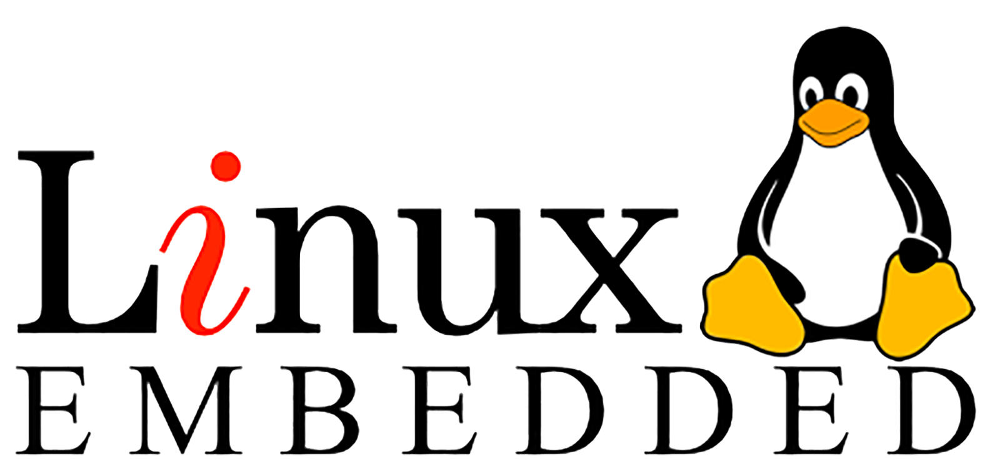

# Embedded Linux Training Repository [NTI-4M]

Welcome to the Embedded Systems Training Repository! This repository contains resources and materials for a comprehensive training program covering various aspects of embedded systems development.

## Table of Contents

- [Linux Kernel Module](#linux-kernel-module)
- [Embedded Linux Module](#embedded-linux-module)
- [C++ OOP and Concurrency](#c-opp-and-concurrency)
- [YOCTO Module](#yocto-module)
- [Device Driver Module](#device-driver-module)
- [IoT Solutions](#iot-solutions)
- [Capstone Project](#capstone-project)

## Linux Kernel Module

This module covers the architecture of the Linux kernel, user space, kernel space, different stacks inside the kernel, common tasks, terminal usage, scripting, service management units, access control, monitoring Linux kernel, and memory management.

## Embedded Linux Module

The Embedded Linux module focuses on elements of Embedded Linux, library explanation and build, toolchain, booting sequence, bootloader, kernel, root-file system, and init process.

## C++ OOP and Concurrency

This module covers fundamentals of C++, template programming, STL, software design principles and artifacts, object-oriented analysis and design, design patterns, system programming, concurrency in C++, Google Testing Framework, CMAKE, and debugging embedded Linux applications.

## YOCTO Module

The YOCTO module introduces YOCTO stages, folder description, layer explanation, variables in YOCTO, build recipes, integration of new recipes, and post-development tasks.

## Device Driver Module

In this module, participants will learn about extending Linux functionality, understanding Linux kernel module concepts, dealing with kernel core helpers, writing Device Tree Blob (DTB) files, understanding overlays, types of drivers, and writing various device drivers including character, GPIO, SPI, block, and LCD (ILI9486) drivers.

## IoT Solutions

The IoT Solutions module covers an introduction to Internet of Things (IoT), IoT architectures and protocols, sensors/actuators, implementing IoT brokers and clients, fog and cloud computing, developing IoT applications, industrial Internet of Things (IIoT), and IoT platform implementation based on MQTT.

## Capstone Project

The Capstone Project module provides participants with an opportunity to apply the knowledge and skills gained throughout the training program to solve a real-world embedded systems problem or develop an innovative embedded systems solution.

Feel free to explore the contents of each module for detailed documentation, code samples, exercises, and other resources.
